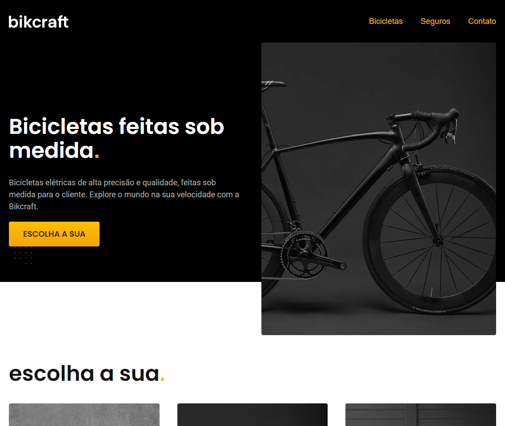
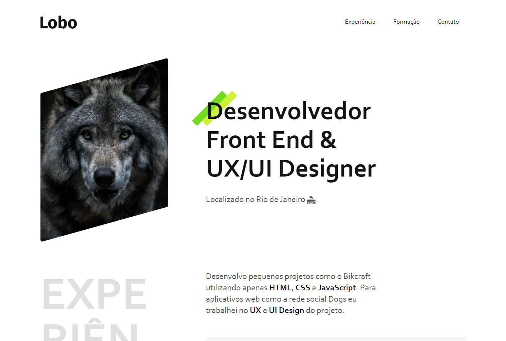

# **Projeto Bikcraft**

Projeto final desenvolvido no curso HTML e CSS para iniciantes da ORIGAMID.
Feito a partir de um design no Figma, com sete modelos de telas diferentes.

## [Clique aqui para navegar agora!](https://fkrik.github.io/origamid-learning/ex4_projeto_final/)

# **Projeto Portifólio**

## [Clique aqui para navegar agora!](https://fkrik.github.io/origamid-learning/ex3_portfolio/)
